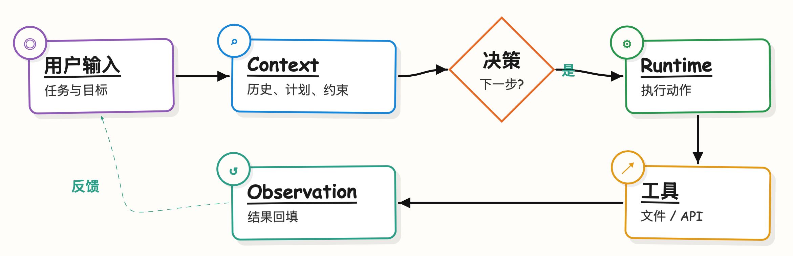
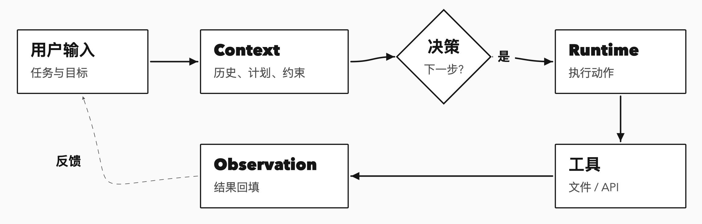
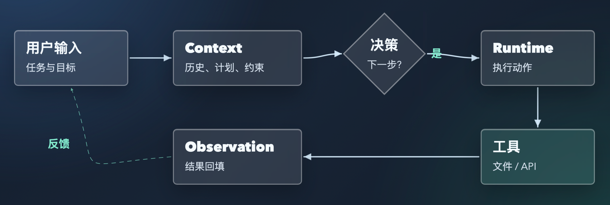
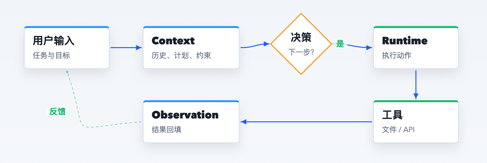
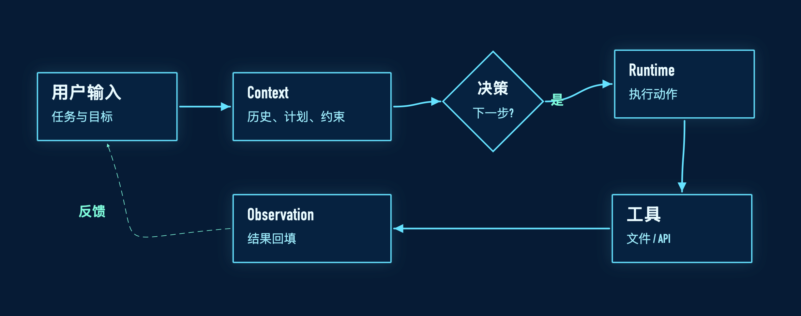
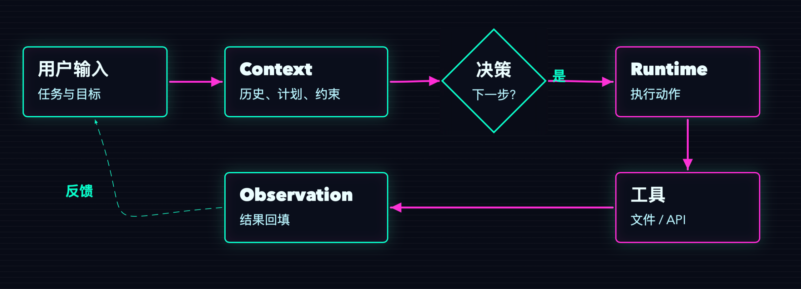
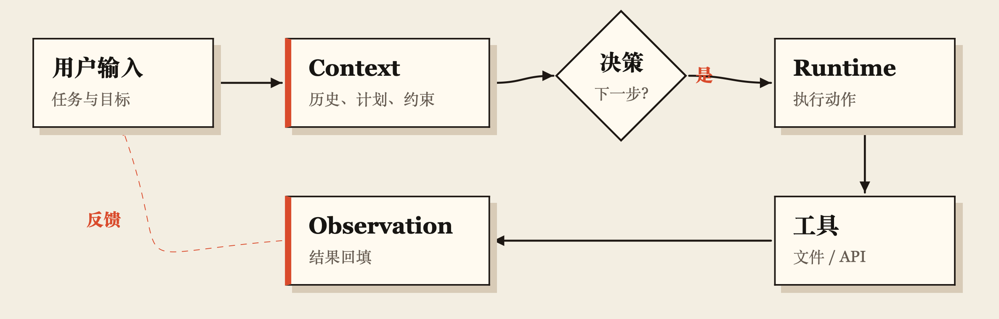
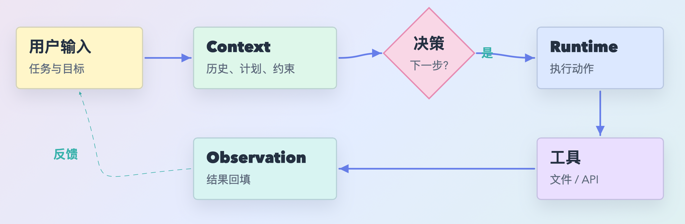
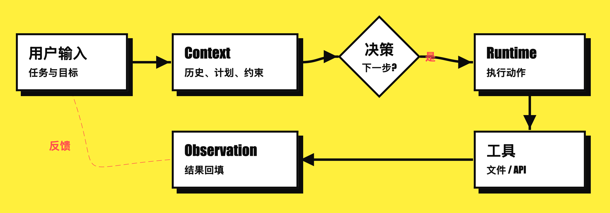
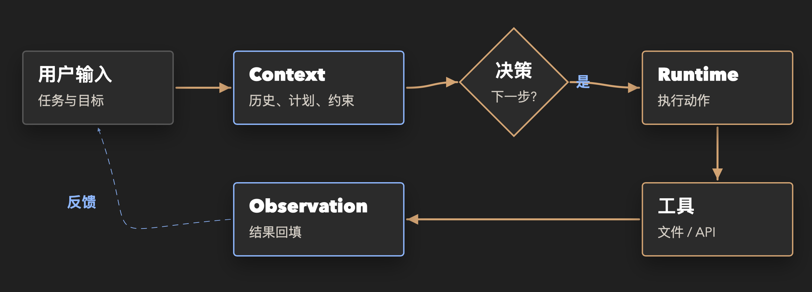

# Flowchart Maker

Flowchart Maker 是一个用于生成、修改、验证和导出流程图的 skill。它适合处理流程图、工作流图、系统流程、Mermaid 图、HTML 流程图、SVG 风格图、PPT 配图和白板风格图。

它采用两层工作方式：

- Mermaid 作为逻辑源，适合快速描述节点和关系。
- HTML/CSS 作为表现层，负责精细排版、可编辑交互、导出和视觉检查。

## 能做什么

- 生成 Mermaid 源文件，方便放进文档和知识库。
- 生成可编辑 HTML 流程图，支持拖拽节点、编辑文字和调整箭头。
- 导出静态 HTML、PNG、SVG 或 PPT 可用图片。
- 生成用于演示、培训、说明页的交互式流程图。

## 主题风格

目前支持 10 种主题。主题名使用英文调用，中文名用于识别风格。

### 🎨 sketch：手绘漫画白板风

偏手绘白板风，适合概念解释、知识卡片、教学图、小红书图文。



### ⬛ mono：黑白线框风

偏黑白线框风，适合技术文档、README、工程说明、简洁流程图。



### 🧊 glass：半透明科技风

偏半透明科技风，适合 AI 平台、产品架构、控制台、自动化流程图。



### 📊 formal：正式架构汇报风

偏正式架构图，适合汇报材料、PPT、平台方案、系统关系图。



### 📐 blueprint：工程蓝图风

偏工程蓝图风，适合系统架构、数据流、模块关系、技术设计说明。



### 🌈 neon：赛博霓虹风

偏赛博霓虹风，适合 AI、MCP、自动化、技术传播和概念海报。



### 📰 editorial：杂志编辑风

偏杂志编辑风，适合方法论拆解、观点表达、报告开篇、知识专题图。



### 🍬 pastel：柔和彩色风

偏柔和彩色风，适合产品说明、用户流程、轻量培训、内部宣导材料。



### 🧱 brutal：粗黑高对比风

偏粗黑高对比风，适合关键结论、冲突对比、传播海报、强表达内容。



### 🌑 dark：深色专业风

偏深色专业风，适合技术汇报、架构说明、正式材料、深色演示页面。



## 交付模式

### `mermaid`

适合知识库、文档、版本管理和快速逻辑迭代。输出通常是 `.mmd` 或包含 Mermaid 代码块的 Markdown。

### `editable`

适合需要手动微调的流程图。支持：

- 拖拽节点
- 编辑节点文字
- 编辑边标签
- 拖动或编辑后自动重绘箭头
- 保存本地编辑
- 重置为默认状态
- 导出 JSON
- 导出 PNG

### `static`

适合布局确认后的最终交付。可输出 HTML、PNG、SVG 或 PPT 可用图片。

### `interactive`

适合产品演示、培训说明、可点击解释流程和交互式页面。

## 常用组合

| 组合 | 适用场景 |
|---|---|
| `sketch + editable` | 概念图、教学图、知识卡片，需要后续手动调整 |
| `mono + editable` | 技术文档、README、工程流程，需要保持极简 |
| `glass + editable` | AI 平台、自动化、控制台、产品架构展示 |
| `formal + static` | 汇报材料、PPT、正式架构图 |
| `blueprint + editable` | 系统架构、数据流、模块关系 |
| `neon + static` | AI、MCP、自动化主题传播图 |
| `editorial + static` | 方法论、观点图、报告开篇 |
| `pastel + editable` | 产品说明、用户流程、轻量培训 |
| `brutal + static` | 关键结论、强对比、传播海报 |
| `dark + static` | 深色技术汇报、正式说明、架构图 |

## 工作流程

1. 先确认必要信息：用途、输出格式、风格要求。
2. 流程逻辑不明确时，先写 Mermaid 版本确认结构。
3. 需要更好排版或视觉质量时，再转成 HTML 版本。
4. `sketch`、`mono`、`glass` 有独立可编辑模板。
5. `blueprint`、`neon`、`editorial`、`pastel`、`brutal`、`dark` 复用稳定可编辑骨架，再套主题样式。
6. 多主题输出时，每个主题单独生成一个 HTML，不默认合成一个总览页。
7. 完成前检查：节点不重叠、文字不溢出、箭头不遮挡文字、反馈路径可见、菱形文字居中。

## 文件结构

```text
flowchart-maker/
  SKILL.md
  README.md
  agents/
    openai.yaml
  assets/
    flowchart-template.html
    editable-flowchart-template.html
    mono-editable-flowchart-template.html
    glass-editable-flowchart-template.html
  docs/
    images/
      sketch.png
      mono.png
      glass.png
      formal.png
      blueprint.png
      neon.png
      editorial.png
      pastel.png
      brutal.png
      dark.png
  scripts/
    check_flowchart_html.py
```

## 默认输出目录

生成流程图时，建议放在当前项目下的任务目录中：

```text
output/flowcharts/<slug>/
  <slug>.mmd
  <slug>.md
  <slug>.html
  <slug>.png
  <slug>.svg
```

只生成用户需要或交付必要的文件。

## 质量检查

重要 HTML 流程图需要预览渲染效果，重点检查：

- 页面不是空白
- 所有节点可见
- 节点之间没有重叠
- 文字没有被裁切
- 箭头连接到正确节点边界
- 反馈箭头足够清楚
- 菱形判断框内文字居中
- 可编辑版本保留保存、重置、导出 JSON、导出 PNG

如果无法渲染预览，至少运行静态检查：

```bash
python3 scripts/check_flowchart_html.py <flowchart.html>
```
