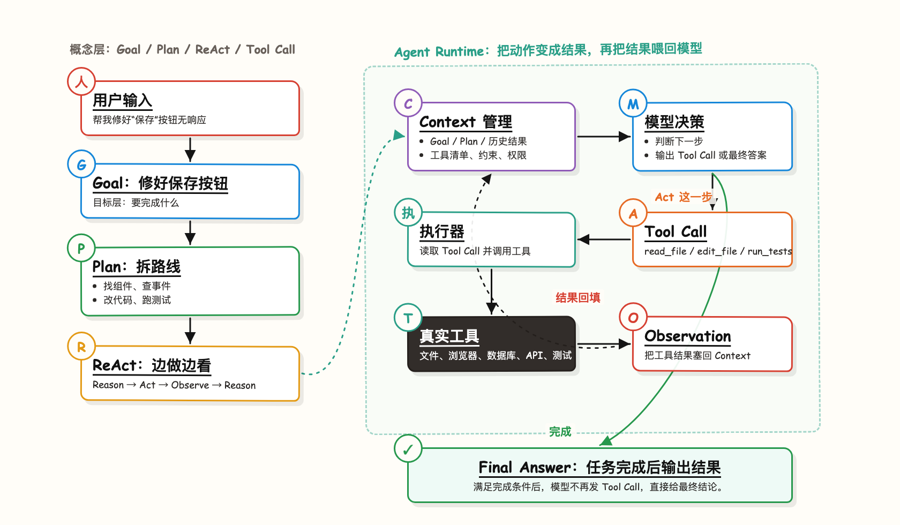
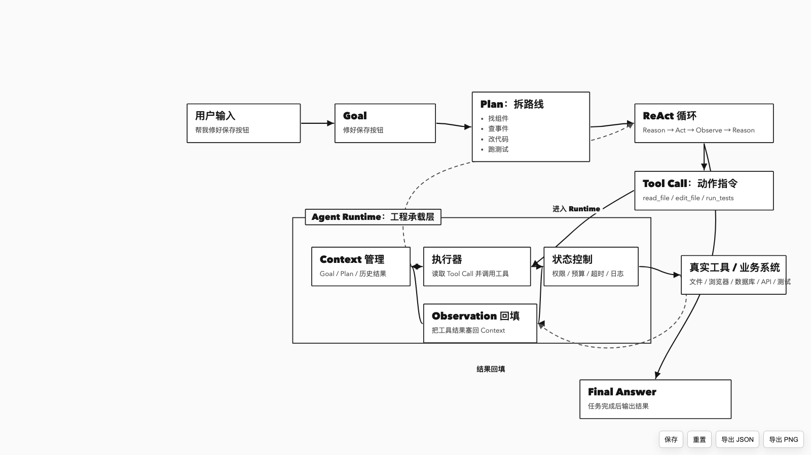
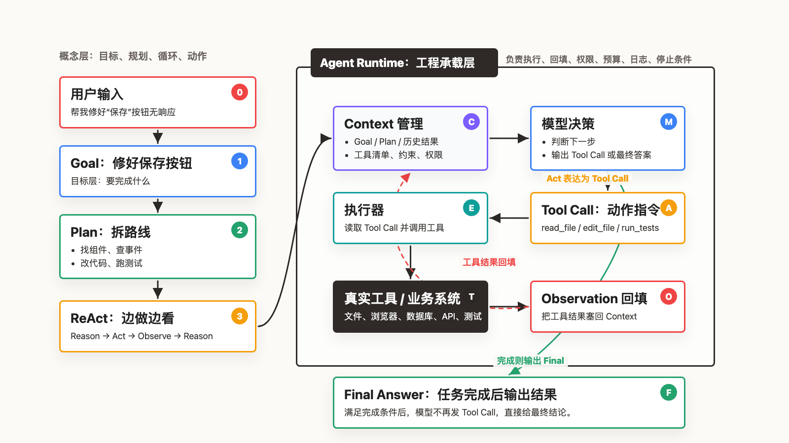

# Flowchart Maker

Flowchart Maker is a Codex skill for creating, refining, validating, and exporting flowcharts, process diagrams, workflow diagrams, system flows, Mermaid diagrams, HTML flowcharts, SVG-style diagrams, PPT-ready diagrams, and whiteboard-style diagrams.

It uses a two-layer workflow:

- Mermaid as the logic source.
- HTML/CSS as the presentation layer for polished layout, editing, export, and visual QA.

## What It Creates

- Mermaid source files for documentation and fast iteration.
- Editable HTML diagrams with draggable nodes and editable labels.
- Static HTML, PNG, SVG, or PPT-ready image exports.
- Interactive diagrams for demos, training, and clickable explanation flows.

## Visual Styles

### `sketch`

Default style.



Use for:

- Concept explanation.
- Knowledge cards.
- Teaching and onboarding.
- Personal knowledge-base diagrams.
- Whiteboard-style discussions.

Visual character:

- Hand-drawn whiteboard feel.
- Casual lines and soft shadows.
- Colorful category accents such as purple, blue, green, amber, orange, and teal.
- Friendly, low-reading-burden composition.

Avoid:

- Dense enterprise boxes.
- Heavy section frames.
- Big black title bars.
- Formal architecture-page composition.

### `mono`

Use for minimal technical diagrams.



Use for:

- Technical documentation.
- README diagrams.
- Engineering explanations.
- Draw.io-like neutral diagrams.
- Black-and-white process diagrams.

Visual character:

- Plain page background.
- Black-and-white wireframe style.
- Single-border rectangular nodes.
- Small solid black arrowheads.
- Dashed gray lines for feedback or secondary flows.
- Editable HTML workflow with save, reset, JSON export, and PNG export.

Avoid:

- Grid backgrounds unless explicitly requested.
- Decorative colors.
- Hand-drawn fonts or comic-style elements.
- Static-only HTML when manual editing is expected.

### `formal`

Use for official or enterprise-facing materials.



Use for:

- Leadership reports.
- Enterprise solution pages.
- PPT-ready architecture diagrams.
- Formal delivery documents.
- Platform relationship diagrams.

Visual character:

- Precise grids.
- Clean rectangular cards.
- Consistent alignment.
- Restrained palette.
- Clear hierarchy and domain classification.

Avoid:

- Excessive hand-drawn looseness.
- Cartoon-like composition.
- Casual visual jokes.

## Delivery Modes

### `mermaid`

Best for:

- Knowledge bases.
- Docs.
- Version control.
- Fast logic iteration.

Output:

- `.mmd`
- Markdown with Mermaid block.

### `editable`

Best when users need to manually correct layout, arrows, or wording.

Capabilities:

- Drag nodes.
- Edit node text.
- Edit edge labels.
- Rerender arrows automatically.
- Save local edits.
- Reset to default.
- Export JSON.
- Export PNG.

For `sketch + editable`, the skill starts from `assets/editable-flowchart-template.html`.

For `mono + editable`, the skill starts from `assets/mono-editable-flowchart-template.html`.

### `static`

Best for final delivery after layout is accepted.

Output can include:

- HTML
- PNG
- SVG
- PPT-ready image

### `interactive`

Best for:

- Demos.
- Training.
- Clickable explanations.
- Product-like walkthroughs.

## Common Combinations

| Combination | Use Case |
|---|---|
| `sketch + editable` | Concept diagrams, teaching diagrams, knowledge cards that may need manual adjustment |
| `sketch + static` | Final whiteboard-style image for sharing or publishing |
| `mono + editable` | Technical docs, README diagrams, engineering process diagrams that need manual adjustment |
| `mono + static` | Final black-and-white wireframe image for docs or architecture notes |
| `formal + editable` | Architecture draft that needs manual adjustment before delivery |
| `formal + static` | Final leadership-report or PPT-ready architecture diagram |
| `formal + interactive` | Product demo or training walkthrough with formal visual language |

## Workflow

1. Clarify only missing essentials: purpose, output format, and required style constraints.
2. Create or update Mermaid logic first when the flow is unclear.
3. Convert accepted logic into HTML when better layout or visual quality is needed.
4. Use the editable template for `sketch + editable` diagrams.
5. Check layout quality before completion:
   - no overlapping nodes
   - no visible text overflow
   - arrows do not cross important text
   - grouped containers have enough padding
   - long labels wrap cleanly
   - feedback loops are visible
6. Export or return the requested files.

## File Layout

```text
flowchart-maker/
  SKILL.md
  README.md
  agents/
    openai.yaml
  assets/
    flowchart-template.html
    editable-flowchart-template.html
    mono-editable-flowchart-template.html
  docs/
    images/
      sketch-example.png
      mono-example.png
      formal-example.png
  scripts/
    check_flowchart_html.py
```

## Default Output Pattern

For generated diagrams, use a task-specific folder:

```text
output/flowcharts/<slug>/
  <slug>.mmd
  <slug>.md
  <slug>.html
  <slug>.png
  <slug>.svg
```

Only create export files that are requested or needed for delivery.

## Validation

For important HTML diagrams, preview the rendered output through browser automation or QuickLook and check:

- chart is not blank
- all nodes are visible
- no node overlaps another node
- text is not clipped
- arrows are visible and connected to the intended node edges
- feedback arrows are readable

If rendered preview is unavailable, run:

```bash
python3 scripts/check_flowchart_html.py <flowchart.html>
```
